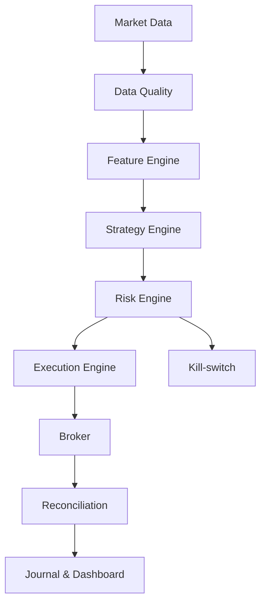

# SPECS — SwingBot AI

> **Statut : IDÉE RÉSERVÉE — NE PAS CONSTRUIRE MAINTENANT**  
> Feu vert uniquement après validation de ForexBot AI : rentable, stable et correctement réconcilié en réel pendant **4 à 8 semaines minimum**, avec un nombre de trades statistiquement exploitable.  
> Créé le 2026-07-15 · Conception : Mario Piston + Jarvis  
> Version : 1.0 — cahier des charges de référence

---

## 0. Avertissement essentiel

SwingBot AI ne peut ni garantir des gains ni supprimer le risque de perte. Son objectif est de rechercher un avantage statistique reproductible, de protéger le capital et de **bloquer automatiquement le passage en réel** tant que les preuves sont insuffisantes.

Le bot ne doit jamais être vendu ou présenté comme une machine à gains. Toute performance doit être mesurée **après spreads, commissions, slippage, swaps, financement, gaps et fiscalité éventuelle**. Le capital réel engagé doit rester une somme dont la perte totale serait supportable.

---

## 1. Vision produit

Créer une application de trading swing/position semi-autonome, conçue pour :

- conserver les positions de 2 jours à plusieurs semaines ;
- générer peu de trades, mais uniquement lorsque toutes les conditions sont réunies ;
- demander peu de surveillance humaine ;
- fonctionner sur des décisions explicables, auditables et reproductibles ;
- prioriser la survie du capital avant la performance ;
- séparer strictement recherche, backtest, shadow, démo et réel.

Le bot idéal n'est pas celui qui trade le plus. C'est celui qui sait rester inactif quand l'avantage est absent.

---

## 2. Principes non négociables

1. **Aucun ordre sans stop-loss broker confirmé.**
2. **Aucune martingale, aucun grid averaging, aucun doublement après perte.**
3. **Aucun déplacement du stop pour augmenter le risque initial.**
4. **Aucune décision d'entrée prise uniquement par un LLM.** L'IA peut classer, résumer et expliquer ; le moteur déterministe valide ou refuse l'ordre.
5. **Risque calculé sur le stop réellement accepté par le broker**, pas sur le stop demandé.
6. **Backtest sans fuite du futur**, avec données et paramètres versionnés.
7. **Coûts réels inclus** : spread variable, slippage, swap, conversion de devise, gap et financement.
8. **Un mode réel impossible à activer par erreur** : double confirmation, compte autorisé, plafond de capital et kill-switch.
9. **Corrélations agrégées** : plusieurs positions corrélées comptent comme une seule exposition de risque.
10. **Abstention par défaut** en cas de données incomplètes, erreur broker, prix obsolète ou incertitude technique.

---

## 3. Différences avec ForexBot AI

| Dimension | ForexBot intraday | SwingBot AI |
|---|---:|---:|
| Horizon | minutes à heures | 2 jours à plusieurs semaines |
| Unités principales | M5 / M15 / H1 | Weekly / Daily / H4 |
| Cycle d'analyse | secondes/minutes | clôture H4, 1 à 4 heures |
| Stops | relativement serrés | ATR Daily / structure Daily |
| Objectif R:R | environ 1,5 à 2 | 2 à 4 lorsque la structure le permet |
| Coût dominant | spread/slippage | swap, financement et gaps |
| Fréquence | plusieurs/jour possible | quelques/semaine maximum |
| Gestion news | filtre intraday | exposition multi-jours et weekend |

---

## 4. Périmètre de la version 1

### Inclus

- Forex majeures liquides : EUR/USD, GBP/USD, USD/JPY, AUD/USD, USD/CAD ;
- éventuellement un indice liquide après validation séparée ;
- analyse Weekly, Daily et H4 ;
- une seule stratégie principale au lancement ;
- backtest, walk-forward, shadow, démo puis réel limité ;
- ordres market et limit si supportés de manière fiable ;
- SL obligatoire, TP optionnel, trailing déterministe ;
- dashboard, journal, alertes et rapport hebdomadaire.

### Exclu de la V1

- crypto 24/7, options, produits illiquides ;
- scalping et haute fréquence ;
- apprentissage en ligne modifiant la stratégie en réel ;
- copy trading ;
- exécution sans validation de données ;
- stratégie multi-agents ou décisions opaques.

---

## 5. Stratégie de référence à tester

La stratégie n'est pas supposée rentable : elle constitue une hypothèse à invalider ou confirmer.

### 5.1 Régime de marché

- **Haussier** : clôture Daily au-dessus de l'EMA 200, EMA 50 ascendante, structure HH/HL.
- **Baissier** : clôture Daily sous l'EMA 200, EMA 50 descendante, structure LH/LL.
- **Neutre/range** : conditions contradictoires ; aucune entrée de tendance.
- Filtre optionnel : ADX Daily supérieur à un seuil optimisé uniquement sur train, jamais sur l'ensemble des données.

### 5.2 Setup d'entrée

1. Tendance Weekly/Daily alignée ou Weekly non opposée.
2. Pullback H4 vers une zone déterministe : EMA 20/50, ancien niveau cassé ou zone ATR.
3. Confirmation H4 à la clôture : rejet, engulfing ou cassure du dernier pivot.
4. Distance au prochain obstacle suffisante pour offrir au moins **2R net de coûts**.
5. Spread, swap, news, corrélation et risque portfolio acceptables.
6. Entrée uniquement sur bougie clôturée ; jamais sur une bougie en formation.

### 5.3 Stop et sortie

- SL au-delà du pivot structurel + buffer de 0,1 à 0,3 ATR Daily ;
- rejet si le stop broker réel rend le R:R inférieur au minimum ;
- prise partielle facultative à 1,5R, uniquement si le backtest démontre une amélioration robuste ;
- passage à break-even jamais automatique avant 1R ;
- trailing sur pivot H4 ou multiple ATR, comparé en backtest ;
- sortie temporelle si le setup n'évolue pas après N bougies H4 ;
- sortie d'invalidation lorsque la structure Daily change ;
- aucune fermeture discrétionnaire par le LLM.

---

## 6. Gestion du risque

### 6.1 Valeurs initiales prudentes

| Paramètre | Shadow/démo | Réel limité |
|---|---:|---:|
| Risque par trade | 0,50 % | 0,25 % au démarrage |
| Risque ouvert total | 1,50 % | 0,75 % |
| Positions simultanées | 3 | 2 |
| Risque par cluster corrélé | 0,75 % | 0,50 % |
| Perte maximale/jour | 1,5 % | 1 % |
| Perte maximale/semaine | 3 % | 2 % |
| Drawdown kill-switch | 8 % | 5 % |

Ces valeurs sont des plafonds de départ, pas des objectifs.

### 6.2 Formule de sizing

`taille = risque_monétaire / perte_par_unité_au_stop_broker`

Le calcul doit intégrer : valeur du pip, devise du compte, distance réelle du stop, spread prévu, slippage de stress, commission et swap estimé sur la durée attendue.

### 6.3 Corrélation et concentration

- calcul glissant des corrélations sur rendements Daily ;
- EUR/USD long + GBP/USD long = exposition USD commune ;
- plafond par devise, indice et facteur de risque ;
- stress test à corrélation 1 en situation de crise ;
- aucune nouvelle entrée si le risque agrégé dépasse le plafond.

### 6.4 Weekend et événements

- pas de nouvelle entrée le vendredi après une heure configurable ;
- réduction ou fermeture avant weekend si événement majeur ou gap historique défavorable ;
- sizing basé sur un scénario de gap au-delà du SL ;
- calendrier macro : banques centrales, inflation, emploi, élections et événements exceptionnels ;
- aucune dépendance aveugle à un calendrier tiers indisponible.

---

## 7. Architecture fonctionnelle



### Modules

- **Market Data** : OHLCV, spread, instruments, swap, calendrier et métadonnées broker.
- **Data Quality** : fraîcheur, trous, doublons, fuseaux, bougies incomplètes.
- **Feature Engine** : ATR, EMA, pivots, régimes, volatilité, corrélations.
- **Strategy Engine** : signal déterministe, score et motifs d'abstention.
- **AI Analyst** : résumé contextuel et explication structurée ; aucun pouvoir d'ordre direct.
- **Risk Engine** : sizing, limites, corrélations, exposition, drawdown.
- **Execution Engine** : idempotence, ordre, SL/TP, confirmation broker.
- **Reconciliation** : positions, transactions, P&L, swaps, erreurs et écarts.
- **Monitoring** : métriques, alertes, heartbeat, rapport quotidien/hebdomadaire.

---

## 8. Machine d'états d'un trade

`CANDIDATE → VALIDATED → RISK_APPROVED → ORDER_SENT → BROKER_CONFIRMED → OPEN → MANAGED → CLOSED → RECONCILED`

États d'échec : `REJECTED`, `EXPIRED`, `ORDER_FAILED`, `PROTECTION_FAILED`, `DESYNC`, `EMERGENCY_CLOSED`.

Chaque transition doit avoir : timestamp UTC, version de stratégie, données sources, décision, motif, payload broker nettoyé et identifiant idempotent.

---

## 9. Usage de l'IA

L'IA reçoit uniquement des données clôturées et structurées. Elle retourne un JSON validé par schéma :

```json
{
  "market_regime": "bullish|bearish|range|uncertain",
  "setup_quality": 0,
  "contradictions": [],
  "event_risks": [],
  "explanation": "",
  "confidence": 0.0
}
```

Règles :

- température basse et prompt versionné ;
- sortie invalide = abstention ;
- confidence IA jamais convertie directement en taille ;
- aucune donnée inventée tolérée ;
- mêmes entrées = décision déterministe du moteur, même si le texte IA varie ;
- journalisation du modèle, du prompt et de la réponse ;
- possibilité de désactiver entièrement l'IA sans empêcher la stratégie de fonctionner.

---

## 10. Données et base

Tables minimales :

- `instruments`, `candles`, `market_features`, `signals` ;
- `risk_snapshots`, `orders`, `broker_events`, `positions` ;
- `transactions`, `daily_equity`, `swap_costs` ;
- `strategy_versions`, `backtest_runs`, `walk_forward_runs` ;
- `system_events`, `kill_switch_events`, `notifications`.

Contraintes : UTC partout, clés uniques broker, données immuables pour les décisions historiques, secrets hors base applicative, chiffrement et moindre privilège.

---

## 11. Backtest crédible

### Obligatoire

- au moins 8 à 12 ans si les données sont disponibles, avec plusieurs régimes ;
- spread variable, slippage aléatoire et défavorable, swap journalier et triple swap ;
- gaps weekend, stop exécuté au premier prix disponible ;
- aucune utilisation de la bougie complète pour décider une entrée à son ouverture ;
- séparation train / validation / test final intact ;
- walk-forward et Monte-Carlo sur l'ordre des trades ;
- comparaison à des baselines simples ;
- sensibilité des paramètres : un plateau robuste, pas un pic optimisé.

### Métriques principales

- rendement net annualisé et rendement absolu ;
- max drawdown, durée du drawdown et temps de récupération ;
- profit factor, expectancy en R, Sharpe et Sortino ;
- taux de réussite, gain/perte moyen, nombre de trades ;
- exposition, turnover, coûts et contribution des swaps ;
- résultats par instrument, année, régime et direction.

### Critères minimaux candidats au passage en shadow

- profit factor hors échantillon ≥ 1,20 après coûts stressés ;
- expectancy hors échantillon > 0,10R/trade ;
- au moins 150 trades agrégés et aucun instrument indispensable à lui seul ;
- max drawdown compatible avec le plafond défini ;
- résultat encore positif avec coûts multipliés par 1,5 ;
- pas de dégradation majeure en walk-forward ;
- Monte-Carlo 95e percentile restant sous le drawdown maximal toléré.

Ces seuils ne prouvent pas une rentabilité future ; ils évitent seulement les candidats manifestement fragiles.

---

## 12. Parcours obligatoire avant argent réel

### Phase A — Recherche

Hypothèse écrite, données vérifiées, baseline, backtest reproductible.

### Phase B — Shadow, 4 à 8 semaines minimum

Signaux en temps réel sans ordre. Vérifier latence, cohérence des bougies, horaires, swap et différences avec le backtest.

### Phase C — Démo, 8 à 12 semaines minimum

Ordres automatiques sur compte dédié. Zéro désynchronisation non expliquée, SL confirmé à chaque trade, P&L réconcilié.

### Phase D — Réel limité

Capital pilote réduit, risque 0,25 % par trade, 2 positions maximum, revue hebdomadaire. Aucun changement de paramètres pendant la fenêtre d'évaluation sauf incident de sécurité.

### Phase E — Montée en charge

Augmentation par paliers uniquement après une nouvelle fenêtre complète, sans dépassement du drawdown et avec performances nettes cohérentes avec la démo.

---

## 13. Go / No-Go réel

Le passage en réel exige **toutes** les conditions :

- ForexBot AI a rempli sa propre condition de stabilité ;
- SwingBot a franchi backtest, shadow et démo ;
- au moins 50 trades forward, idéalement davantage ;
- expectancy forward positive après tous les coûts ;
- écart backtest/forward compris et acceptable ;
- aucun incident critique non résolu depuis 30 jours ;
- kill-switch testé ;
- récupération après panne testée ;
- plafond de perte accepté à froid par Mario ;
- revue humaine et signature d'une checklist de mise en réel.

Un seul échec = **NO-GO**.

---

## 14. Kill-switch et incidents

Arrêt immédiat des nouvelles entrées si :

- drawdown, perte journalière ou hebdomadaire dépassé ;
- données trop anciennes, trous ou horloge désynchronisée ;
- position broker inconnue ou écart de réconciliation ;
- SL absent/non confirmé ;
- marge insuffisante ou changement de spécification instrument ;
- nombre anormal d'ordres/rejets ;
- indisponibilité prolongée du broker ;
- volatilité extrême hors modèle ;
- activation manuelle.

Selon l'incident, les positions existantes sont soit protégées et gérées, soit fermées selon une procédure préétablie. Le comportement ne doit jamais être improvisé par l'IA.

---

## 15. Interface application

### Écrans

1. **Vue d'ensemble** : equity, drawdown, risque ouvert, mode, santé système.
2. **Opportunités** : setups détectés, conditions validées/refusées et raisons.
3. **Positions** : entrée, SL, risque R, swap cumulé, scénario d'invalidation.
4. **Risque portfolio** : exposition devises, clusters corrélés, stress tests.
5. **Performance** : net de coûts, courbe equity, drawdowns, résultats par régime.
6. **Journal** : chaque décision et événement broker.
7. **Laboratoire** : backtests et comparaisons de versions, séparé du live.
8. **Sécurité** : mode, plafonds, kill-switch et checklist réelle.

Le bouton réel doit être visuellement distinct, protégé par confirmation et impossible si la checklist automatique échoue.

---

## 16. Tests indispensables

- tests unitaires indicateurs, sizing, conversion FX et arrondis ;
- tests de propriétés : le risque ne dépasse jamais le plafond ;
- tests d'idempotence et de retry ;
- simulation ordre accepté mais réponse réseau perdue ;
- SL rejeté, partiellement exécuté ou modifié par le broker ;
- changement d'heure été/hiver et clôtures Daily ;
- gap au-delà du stop ;
- panne Supabase, broker, IA, Telegram et dashboard ;
- redémarrage avec positions ouvertes ;
- chaos tests en démo ;
- test de restauration et export complet du journal.

---

## 17. Infrastructure réutilisable de ForexBot

- authentification et connexion Capital.com ;
- passage d'ordres et lecture positions ;
- réconciliation via historique des transactions ;
- sizing sur stop broker réel ;
- lecture des distances minimales ;
- kill-switch, marge pré-trade, anti-doublon ;
- notifications Telegram et dashboard ;
- pipeline IA, mais avec nouveau prompt et rôle limité.

À créer séparément : projet Supabase, compte démo, secrets, stratégie swing, données Daily/H4, modèle de swap, backtest et monitoring spécifiques.

---

## 18. Plan de réalisation — uniquement après GO

1. Geler l'hypothèse de stratégie et les métriques de succès.
2. Auditer les données et construire le backtester événementiel.
3. Tester baselines puis stratégie, sans optimisation excessive.
4. Effectuer validation hors échantillon, walk-forward et Monte-Carlo.
5. Cloner uniquement les composants ForexBot validés.
6. Construire les moteurs données, stratégie, risque et exécution.
7. Tester en shadow, puis en démo.
8. Faire une revue de sécurité et de performance.
9. Démarrer en réel limité si et seulement si le Go/No-Go est entièrement vert.
10. Augmenter le capital par paliers, jamais après une courte série gagnante.

---

## 19. Décisions à prendre le jour du GO

- instruments exacts et type de compte ;
- swing 2–10 jours ou position plus longue ;
- stratégie finale parmi les variantes testées ;
- fournisseur de données historique et qualité du swap ;
- règles de weekend et calendrier macro ;
- capital pilote et perte maximale acceptable ;
- seuils définitifs validés avant de voir les résultats réels ;
- cadre fiscal et réglementaire applicable.

---

## 20. Rappel discipline

> Ce document capture l'idée sans ouvrir un nouveau chantier. Tant que ForexBot AI n'est pas validé selon les critères fixés, aucune infrastructure SwingBot n'est créée et aucun capital n'est engagé. La meilleure protection contre l'échec est de ne pas confondre une bonne idée, un beau backtest et une preuve de rentabilité réelle.

